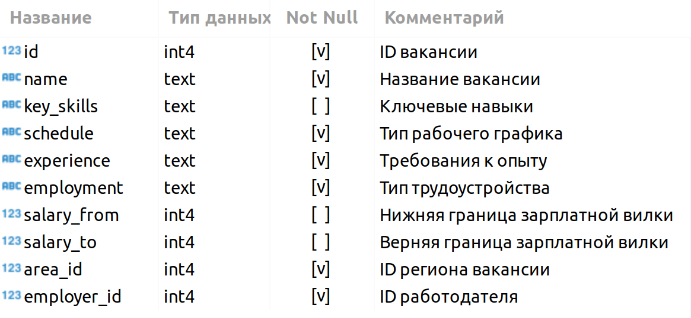
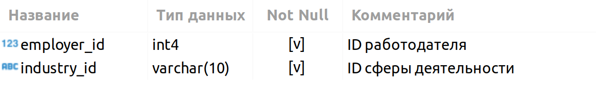

# Проект Project HeadHunter PostgreSQL.

## Оглавление  
[1. Описание проекта](README.md#Описание-проекта)  
[2. Какой кейс решаем?](README.md#Какой-кейс-решаем)  
[3. Краткая информация о данных](README.md#Краткая-информация-о-данных)  
[4. Этапы работы над проектом](README.md#Этапы-работы-над-проектом)  
[5. Результат](README.md#Результат)    
[6. Выводы](README.md#Выводы) 

### Описание проекта    
Провести обработку данных из базы резюме, выгруженной с сайта поиска вакансий hh.ru.

:arrow_up:[к оглавлению](_)

### Какой кейс решаем?    
1. Знакомство с данными;
2. Предварительный анализ данных;
3. Детальный анализ вакансий;
4. Анализ работодателей;
5. Предметный анализ.

**Условия:**  
→ Решение оформляется только в Jupyter Notebook.
→ Решение оформляется в соответствии с ноутбуком-шаблоном.
→ Каждое задание выполняется в отдельной ячейке, выделенной под задание (в шаблоне они помечены как ваш код здесь). Не следует создавать много ячеек для решения задачи — это провоцирует неудобства при проверке.
→ Текст SQL-запросов и код на Python должны быть читаемыми. Не забывайте про отступы в SQL-коде.
→ Выводы по каждому этапу оформляются в формате Markdown в отдельной ячейке (в шаблоне они помечены как ваши выводы здесь).
→ Выводы можно дополнительно проиллюстрировать с помощью графиков. Они оформляются в соответствии с теми правилами, которые мы приводили в модуле по визуализации данных.
→ Не забудьте удалить ячейку с данными соединения перед фиксацией работы в GitHub.

**Метрика качества**     
....

**Что практикуем**     
Работу с данными и оформление отчетов с помощью библиотек:
- pandas
- psycopg2

### Краткая информация о данных
VACANCIES
Таблица хранит в себе данные по вакансиям и содержит следующие столбцы:

Зарплатная вилка — это верхняя и нижняя граница оплаты труда в рублях (зарплаты в других валютах уже переведены в рубли). Соискателям она показывает, в каком диапазоне компания готова платить сотруднику на этой должности.

AREAS
Таблица-справочник, которая хранит код региона и его название.

EMPLOYERS
Таблица-справочник со списком работодателей.

INDUSTRIES
Таблица-справочник вариантов сфер деятельности работодателей.

EMPLOYERS_INDUSTRIES
Дополнительная таблица, которая существует для организации связи между работодателями и сферами их деятельности.

Эта таблица нужна нам, поскольку у одного работодателя может быть несколько сфер деятельности (или работодатели могут вовсе не указать их). Для удобства анализа необходимо хранить запись по каждой сфере каждого работодателя в отдельной строке таблицы.

:arrow_up:[к оглавлению](README.md#Оглавление)

### Этапы работы над проектом  

:arrow_up:[к оглавлению](README.md#Оглавление)

### Результаты:  
....

:arrow_up:[к оглавлению](README.md#Оглавление)

### Выводы:  
....

:arrow_up:[к оглавлению](README.md#Оглавление)
